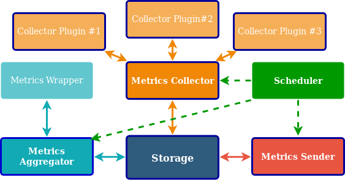

# Chouette-IoT Design

Chouette is based on having a third-party broker, where raw and processed metrics are being stored prior to be sent to Datadog.

At the moment the only storage that Chouette supports is **Redis**. Probably in the future other storages will be added as well.

Most of Chouette objects are Pykka actors. Some of these actors (e.g. Collector Plugins) have companion object to abstract data collection/processing logic from  messages handling logic and to increase Chouette testability.

## Chouette Metrics Workflow

1. **Storage** actor is the very center of the whole design. There is a set of messages defined in the **storages** module, these message are used by other actors to collect, store and cleanup data.  
**Redis** storage also has a set of special Redis messages used to receive sizes of Dramatiq message queues.  

2. **Metrics Sender** is a part that is responsible for interaction with Datadog. It requests ready to dispatch metrics from the **Storage** actor and tries to send them to Datadog. If these metrics were sent successfully, they are being cleaned up from a storage. Otherwise they are being kept there until they are finally dispatched or become too old to be sent to Datadog.  
Datadog rejects metrics older than 4 hours, so outdated metrics are being cleaned up on every Sender run.  
Before being sent, metrics are being compressed to decrease traffic as much as possible.

3. **Metrics Aggregator** is an actor that collects raw metrics sent by other applications (or Chouette itself if self monitoring is on) and [aggregates](https://docs.datadoghq.com/developers/dogstatsd/data_aggregation/) them.  
By default Metrics Aggregator has the same 10 seconds `aggregate_interval` or `flush_interval` that DogStatsD server has.  
All the received metrics are being separated into chunks of 10 seconds and being processed to generate a metric or a set of metrics describing this set.  

4. **MetricsWrapper** is not an actor, but that's an object that defines how different raw metrics should be interpreted. It gives Chouette additional flexibility.  
E.g. **DatadogWrapper** wrapper which is the default option, tries to follow Datadog aggregation logic and Datadog metric types. It doesn't support `Distribution` metrics, but it knows how to handle `Count`, `Gauge`, `Rate`, `Set` and `Histogram`. For the latter it has environment variables `HISTOGRAM_AGGREGATES` and `HISTOGRAM_PERCENTILES`, playing the same role as they play in Datadog Agent configuration file (See **Note** [here](https://docs.datadoghq.com/developers/metrics/types/?tab=histogram#metric-types)).  
At the same time **SimpleWrapper** knows only two types of metrics - `Count` and `Gauge`. And it interprets the latter differently to Datadog. While Datadog expects `gauge` to be the **last** value received during a flash interval, here it is an **average** of all values.  
Defining custom wrappers gives you a chance to send only data that you really need and to avoid spending extra money on Datadog support.

5. **Metrics Collector** is an actor that collects data about a node. It's a very simple actor itself, on any message that is not a special **StatsResponse** object, it sends **StatsRequests** messages to all of its plugins. These plugins collect metrics about their field of responsibility and sends them back in a **StatsResponse** message. On that message **Metrics Collector** sends received data to a storage to be stored. Interaction with collector plugins happens with a `tell` Pykka pattern, so it's fully asynchronous.

6. **Collector Plugins** are also actors who are able to receive **StatsRequest** messages and to send **StatsResponse** messages back. Every plugin should be able to get data about some small fields. And it's desirable that it sends *as little data as possible*.  
Information about plugins can be found [here](./COLLECTOR_PLUGINS.md).  
Plugins examples are: **K8sCollector** that collects metrics from K8s Stats Service and **DockerCollector** that collects containers metrics from a docker socket file.

7. **Scheduler** is not an actor. Since actors need to receive a message to perform their job and since job of all these actors must be executed periodically, Chouette needs an object that is able to send these metrics at some fixed rate. Scheduler's idea is based on Akka Scheduler approach and `threading.Timer` and is able to do more than just sending messages to actors.

On startup Chouette takes desired intervals from environment variables and schedules periodical dispatching of messages to **MetricsAggregator**, **MetricsCollector** and **MetricsSender**.

If for some reason one of these three actors is crashed, application stops.